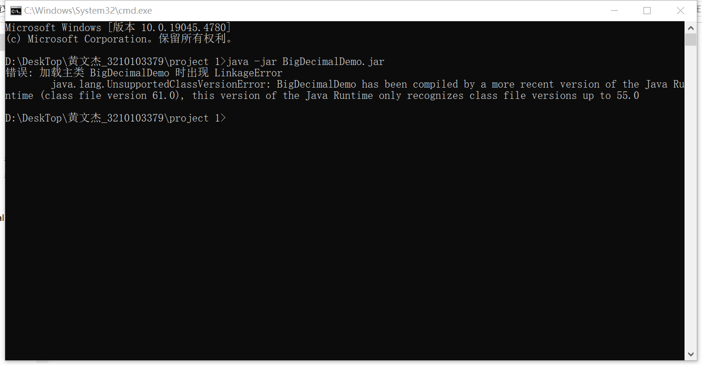

## JDK 环境

本实验所用的JDK环境是 **JDK 17**，请确保本机已经安装 **JDK17** 以上的环境，并做了相关配置

> 如果本机的JDK版本不到17可能会运行不了 `jar` 文件，具体错误可能如下图所示：




## 运行步骤

在文件夹下已经包含了 `BigDecimalDemo.java` ,`BigDecimalDemo.jar`,`BigDecimalDemo.class`三个核心文件（本实验相关的代码文件），如果本机已经安装过**JDK**环境并且做了相关配置，只需要文件目录下打开**cmd**窗口，并运行如下命令即可执行**jar**文件：

```bash
java -jar BigDecimalDemo.jar
```


如果运行不了，可以尝试检查是否安装和配置了**JDK**环境，然后尝试重新生成**jar**文件，步骤如下：

### 1. 编译 Java 文件

首先，需要将 `.java` 源文件编译成 `.class` 字节码文件。

```bash
javac -encoding UTF-8 BigDecimalDemo.java
```


这会在当前目录下生成对应的 `.class` 文件。

### 2. 创建 JAR 文件

使用 `jar` 命令将编译好的 `.class` 文件打包成 JAR 文件。

```bash
jar cvf BigDecimalDemo.jar BigDecimalDemo.class
```

其中：

- `c` 表示创建 JAR 文件
- `v` 表示详细输出过程
- `f` 指定输出文件的文件名

这个命令会把当前目录下的 `.class` 文件全部打包到 `BigDecimalDemo.jar` 文件中。

### 3. 指定入口点（创建可执行 JAR）

如果需要生成一个可执行 JAR 文件（包含 `main` 方法的入口类），可以指定一个 `Manifest` 文件或直接通过命令行指定入口类。

**通过命令行指定主类：**

```bash
jar cfe BigDecimalDemo.jar BigDecimalDemo  BigDecimalDemo.class
```

### 4. 运行 JAR 文件

在当前目录下的**cmd**窗口中执行如下命令

```bash
java -jar BigDecimalDemo.jar
```


提供一张我打包运行**jar**文件的**cmd**窗口命令截图：

